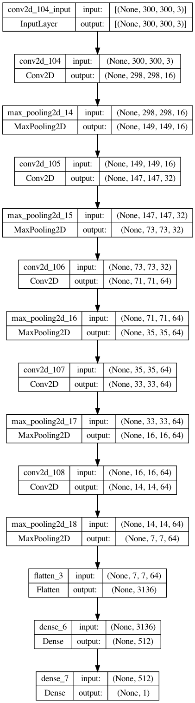

# Image classification using transfer learning

## Table of Contents
* [General Info](#general-information)
* [Results](Results)
* [Technologies Used](#technologies-used)
* [Contact](#contact)
<!-- * [License](#license) -->

## General Information
- The goal of the project is to develop a model to perform binary image classification using CNN
- Firstly, I am using a simple CNN model

- The dataset is [horse vs human](https://www.tensorflow.org/datasets/catalog/horses_or_humans).
- As you can see in the results, the preprocessing techniques used in augmenting the data did not help much in the results. The validation accuracy is fluctuating and not trending up like the training accuracy. This might be because the additional training data generated still do not represent the features in the validation data.
- Therefore, improvement is made by using transfer learning using Inception V3 model. This model achives an accuracy of 99.9% on the first epoch. 

## Results

<!-- If you have screenshots you'd like to share, include them here. -->

## Technologies Used
- Python
- Tensorflow
- Pandas
- Matplotlib
- Keras

## Contact
Created by [Miralireza Nabavi](anabavib@asu.edu) - feel free to contact me!
